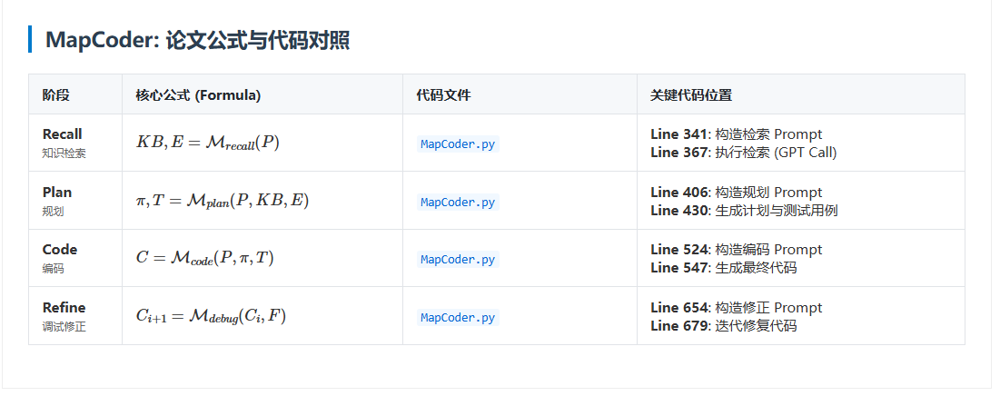
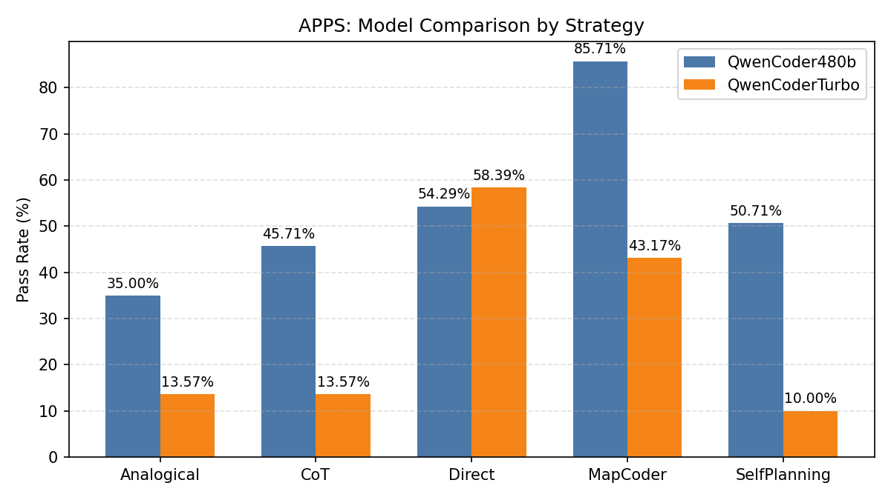
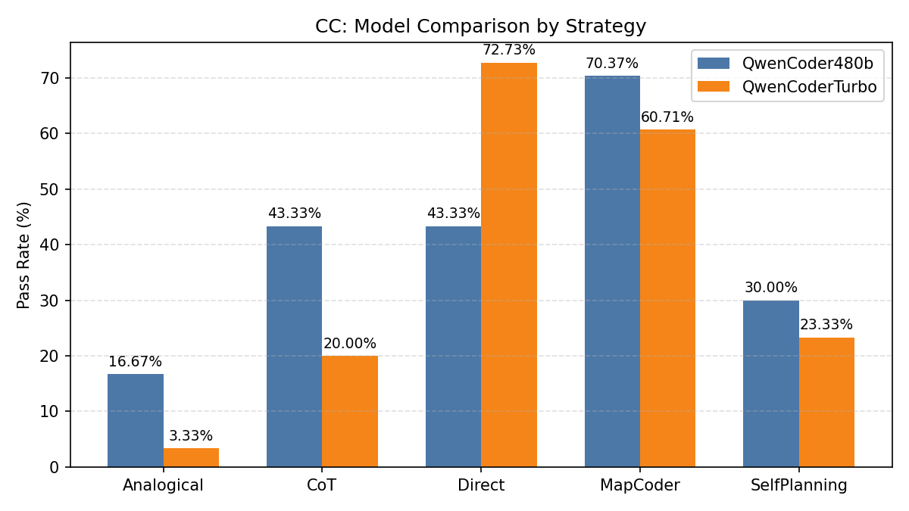
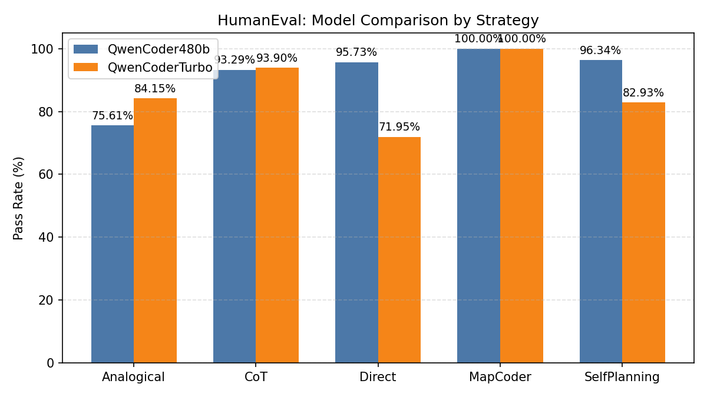
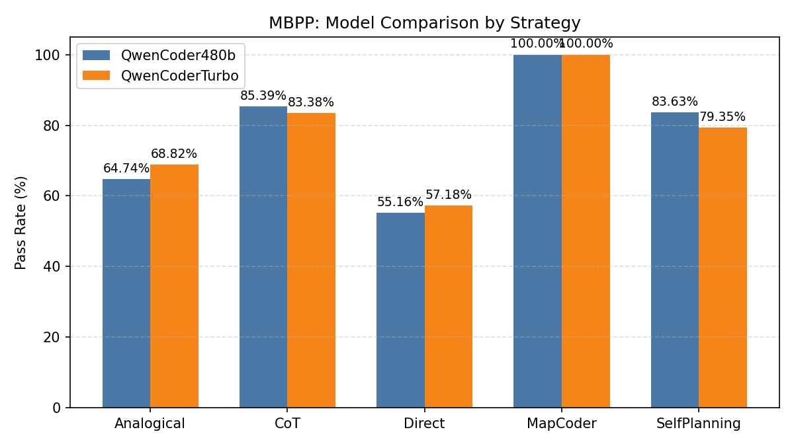
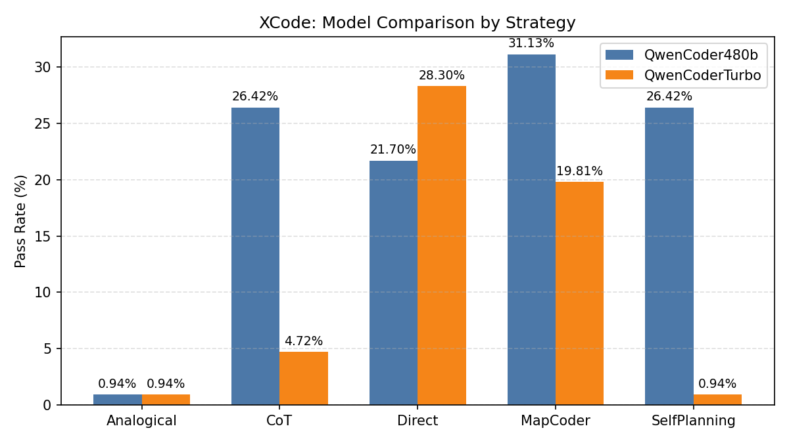
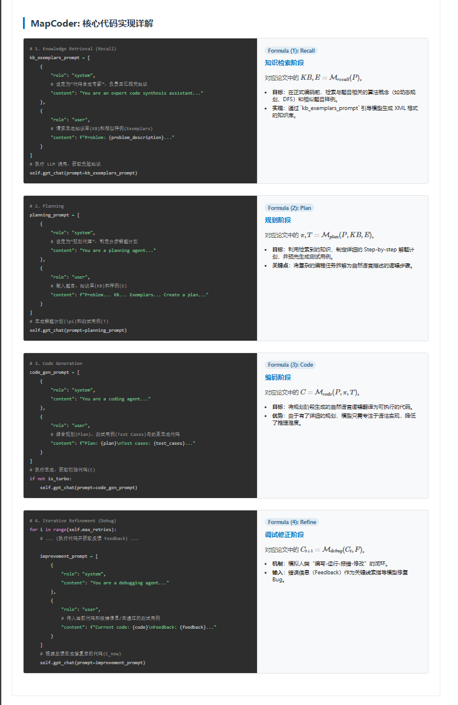

# MapCoder 复现课程报告

## 1. 论文总结

### 研究背景与问题 (Problem)
在软件工程和人工智能领域，自动化代码生成（Code Generation）一直是一个核心挑战。尽管大型语言模型（LLMs）如 GPT-4 在自然语言处理任务上取得了显著进展，但它们在解决复杂的编程竞赛问题（如 Codeforces, LeetCode 困难题目）时仍面临巨大困难。
主要问题在于：
1.  **缺乏系统性思维**：现有的直接生成（Direct）或思维链（CoT）方法通常试图“一步到位”地生成代码，忽略了人类程序员解决复杂问题时的多阶段认知过程（理解-规划-编码-调试）。
2.  **推理与实现的断层**：模型往往难以将高层次的算法思路准确转化为低层次的语法实现，尤其是在处理边界情况（Edge Cases）和复杂数据结构时。
3.  **缺乏自我修正能力**：一旦生成的代码包含 Bug，单次生成的模型无法像人类一样利用编译器报错或测试反馈进行迭代修复。

### 解决方案 (Solution)
为了解决上述问题，论文提出了 **MapCoder**，这是一个受人类编程认知过程启发的多智能体（Multi-Agent）框架。该框架将复杂的代码生成任务分解为四个相互协作的子任务，模拟人类程序员的思维循环：
*   **知识检索 (Recall Agent)**：首先通过检索相关算法概念和相似题目示例，激活模型的“相关记忆”，为解题提供先验知识。
*   **规划 (Planning Agent)**：利用检索到的知识，制定详细的分步解题计划，并预先设计具有代表性的测试用例，确保解题思路的正确性。
*   **编码 (Coding Agent)**：基于规划和测试用例，专注于将逻辑转化为具体的代码实现，减少了直接从问题到代码的认知负荷。
*   **调试 (Debugging Agent)**：通过执行生成的代码并分析反馈（如错误信息或未通过的测试用例），进行迭代式的代码修正，直至通过测试或达到最大尝试次数。

MapCoder 通过这种结构化的多智能体协作，显著提升了 LLM 在复杂编程任务上的表现，在 APPS、CodeContests 和 xCodeEval 等高难度基准测试中均取得了 State-of-the-art (SOTA) 的结果。

### 方法流程图 (Flowchart)


*(上图展示了 MapCoder 的完整工作流：从问题描述开始，经过 Recall -> Plan -> Code -> Debug 的闭环过程)*

## 2. 论文公式与代码对照表

MapCoder 将编程过程形式化为以下四个阶段。下图展示了论文公式与代码实现的对照。



## 3. 安装与运行说明

### 环境要求
- Windows/Linux/MacOS
- Python 3.8+
- OpenAI Compatible API Key (支持 DeepSeek, Minimax, Qwen 等模型)

### 安装步骤
1. 克隆项目代码：
   ```bash
   git clone https://github.com/YourRepo/MapCoder.git
   cd MapCoder
   ```

2. 安装依赖：
   ```bash
   pip install -r requirements.txt
   ```

3. 配置环境变量：
   在项目根目录创建 `.env` 文件，填入 API Key：
   ```env
   OPENAI_API_KEY=your_api_key
   OPENAI_API_BASE=your_api_base
   OPENAI_MODEL=your_model_name
   
   ```

### 运行复现

您可以使用以下命令在不同数据集上复现实验结果（默认使用 QwenCoderTurbo 策略）：

#### 1. APPS 数据集
```bash
python scripts/run_parallel.py --dataset APPS --strategy MapCoder --model QwenCoderTurbo --parallel 10
```

#### 2. CodeContest 数据集
```bash
python scripts/run_parallel.py --dataset CodeContest --strategy MapCoder --model QwenCoderTurbo --parallel 10
```

#### 3. HumanEval 数据集
```bash
python scripts/run_parallel.py --dataset HumanEval --strategy MapCoder --model QwenCoderTurbo --parallel 10
```

#### 4. MBPP 数据集
```bash
python scripts/run_parallel.py --dataset MBPP --strategy MapCoder --model QwenCoderTurbo --parallel 10
```

#### 5. XCode 数据集
```bash
python scripts/run_parallel.py --dataset XCode --strategy MapCoder --model QwenCoderTurbo --parallel 10
```

## 4. 测试/运行结果截图

以下展示了不同数据集上 MapCoder (QwenCoder480b) 与 Baseline (QwenCoderTurbo) 的性能对比。

### APPS 数据集 (主要测试对象)


### CodeContest 数据集


### HumanEval 数据集


### MBPP 数据集


### XCode 数据集


## 5. 代码注释说明
已在核心文件 `src/promptings/MapCoder.py` 中添加了对应论文公式的详细注释。下图展示了关键代码段的实现细节：


